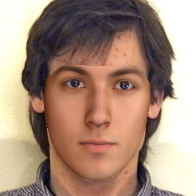

# Face reconstruction and relighting

[Duan Gao](https://gao-duan.github.io/)

|  |  |  |  |  |
| ------------------------------------------------ | ---------------------------------------------- | ---------------------------------------------- | ------------------------------------------ | ----------------------------------------- |
|  |  |  |  |  |
| input image                                      | reconstruct image                              | high-frequency albedo                          | relit video                                | relit video(after propagation)            |

Project for reconstructing 3D face from a single image and recovering high-frequency albedo. This can be used in many face applications like face relighting and face editing. You can find more algorithm details in [documentation](./documentation/documentation.pdf).

## Dependencies

- OpenCV 3.4
- Dlib
- Only support Visual Studio now. (Maybe extend to CMake later.)

## Compile

- Set opencv and dlib dependencies inside Visual Studio.
- Generate BFM data
  - Download raw BFM data from https://faces.dmi.unibas.ch/bfm/ (Extracting `01_MorphableModel.mat` and `04_attributes.mat` into `./data/BFM/BaselFaceModel/`)
  - Download 3DDFA from http://www.cbsr.ia.ac.cn/users/xiangyuzhu/projects/3DDFA/Code/3DDFA.zip  (Extracting `model_info.mat` and `Model_Expression.mat` into `/data/BFM/3DDFA/`)
  - Run `cd ./data/BFM/ && python convert.py` (dependencies: numpy, scipy) 
- Build and run.

## Command line parameters

- run 

  ```./FaceRelighting.exe $SOLUTION_PATH  $OUTPUT_FOLDER  $INPUT_IMAGE_PATH [$IMAGE_RESOLUTION]```

  >  Example:
  >
  > cd FaceRelighting
  >
  > PATH_TO_EXE/FaceRelighting.exe   ./  ./res/  ./data/example/image.png 250

  $IMAGE_RESOLUTION is the image size of input image. (default value is 250, means 250 x 250)

  Please make sure the input image is square (width equals to height).

  

- Convert to GIF (using ImageMagick)

  >  convert '%d.bmp[0-19]' out.gif 


